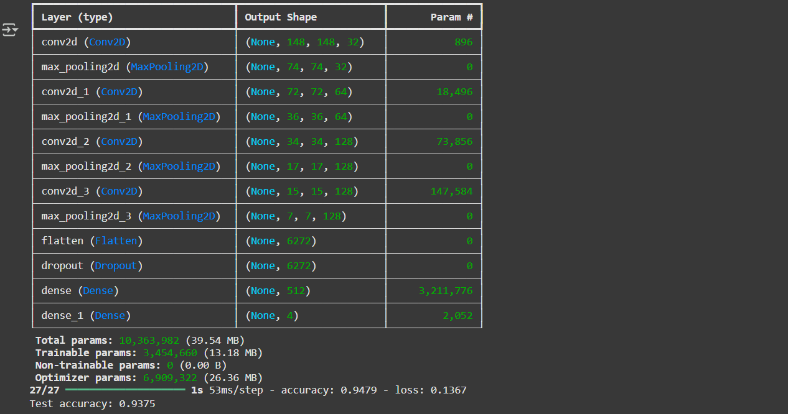
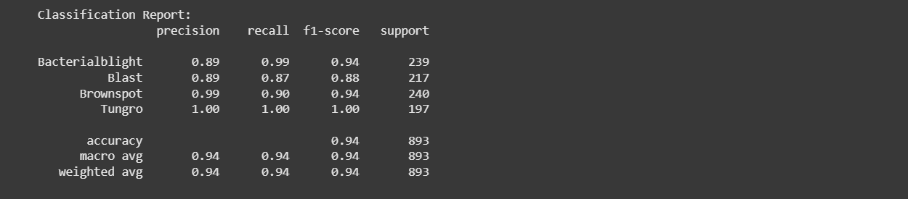

# Rice Leaf Disease Classification using CNN

## Introduction

Rice is one of the most important staple crops worldwide. However, rice plants are highly vulnerable to various leaf diseases that can significantly reduce crop yield and quality.

## Project Overview

This project develops a Custom Convolutional Neural Network (CNN) model to classify rice leaf diseases using deep learning.

The model automatically identifies four major rice diseases:
- Bacterial Blight
- Blast
- Brown Spot
- Tungro

Early detection of rice diseases is critical to prevent crop loss and improve agricultural sustainability. This solution demonstrates how computer vision can support smart farming through automated disease diagnosis.

---

## Dataset

Source: [Kaggle – Rice Leaf Disease Image Dataset](https://www.kaggle.com/datasets/nirmalsankalana/rice-leaf-disease-image) 

-Total Classes: 4 

-Training Images: 4150  
-Validation Images: 889  
-Test Images: 893  

The dataset is structured using folder-based labeling, enabling automatic class encoding via TensorFlow's ImageDataGenerator.

---

## Model Architecture

A custom Sequential CNN was built using TensorFlow/Keras:

- Conv2D (32 filters, 3x3)
- MaxPooling
- Conv2D (64 filters)
- MaxPooling
- Conv2D (128 filters)
- MaxPooling
- Conv2D (128 filters)
- MaxPooling
- Flatten
- Dropout (0.5)
- Dense (512, ReLU)
- Dense (4, Softmax)

Total Parameters: 10,363,982

---

## Data Preprocessing

- Image resizing: 150x150
- Pixel normalization (Rescale 1/255)
- Data augmentation:
  - Rotation (40°)
  - Width/Height shift (20%)
  - Zoom
  - Shear
  - Horizontal flip

Train/Validation/Test Split:
- 70% / 15% / 15%

---

## Model Performance

Test Accuracy: 93.75%

Classification metrics include:
- Precision
- Recall
- F1-score
- Macro & Weighted averages

The model demonstrates strong performance across all four classes, with Tungro achieving near-perfect classification.

---

## Business Impact

- Enables early disease detection in rice crops
- Reduces pesticide misuse
- Prevents large-scale crop loss
- Supports AI-driven smart agriculture solutions

Potential applications:
- Mobile agricultural diagnostic apps
- Drone-based crop monitoring systems
- Farm advisory platforms

---

## Learning Outcomes

Through this project, I gained practical experience in:

- Building and training custom CNN architectures  
- Applying image preprocessing and data augmentation  
- Handling multi-class classification problems  
- Evaluating models using classification metrics  
- Visualizing predictions and model performance  
- Structuring an end-to-end deep learning workflow

---

## Tech Stack

- Python
- TensorFlow / Keras
- NumPy
- Matplotlib
- Scikit-learn
